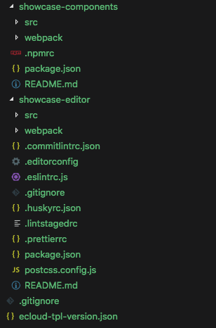

## 设计平台开发指南
模版开发主要分为三步：
1. 组件开发
a. h5组件开发（用于真实页面显示）
b. pc编辑器开发 （用于商家在微商城后台配置数据）
2. mock数据配置 （用于商家购买之前使用该mock数据预览）
3. 模版配置，保存上传 

### 组件开发
- 编辑器主要是为店铺装修中C端（小程序组件和H5组件）提供编辑数据。
- 开发步骤：

1. 双击项目进入模版开发页面，系统会自动初始化开发目录，如下

2. 命令行 分别进入 `showcase-components` 和 `showcase-editor` 目录执行一下命令
```bash
npm install
npm run dev
```
3. 创建自定义组件，代码库中会生成组件开发目录，在对应目录进行开发  
- 组件name和编辑器type 是一致的
-  ⚠️注意：  
- 使用有赞云开发者工具创建删除组件，请勿自行操作文件，直接操作可能会产生未知错误。
- 组件列表以项目工程下 dist 目录中组件信息为准，故请开发时确认代码更新，并运行 `npm run dev` 
4. h5预览可进行开发调试

### mock数据
用于在商家在购买模版前预览使用

### 模版配置
1. 新增模版
2. 进入预览配置，可对已有组件进行组合，并添加数据，确认模版配置完成点击保存按钮，保存成功则可前往设计平台进行模版上架操作
