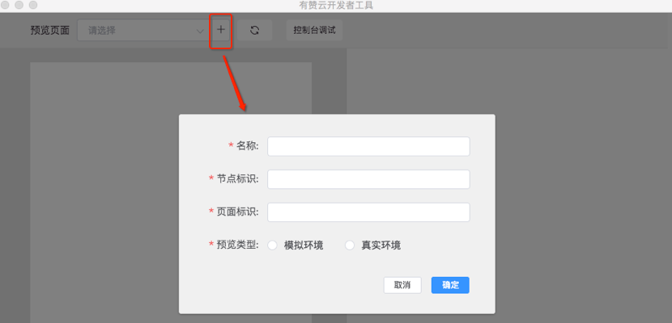
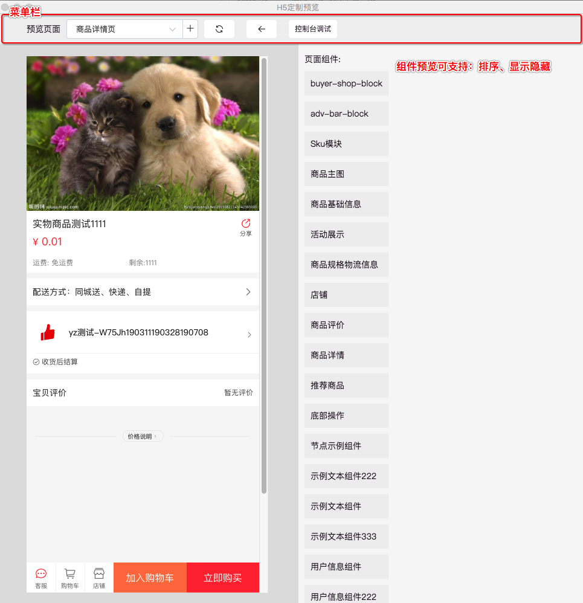

### 组件定制介绍
#### 概念
1. 节点: 核心交易链路下拆分出定制节点
2. 模版: 1个节点下存在一个及以上定制页面模版

#### 预览页面配置

名称：自定义，方便识别  
节点标识：当前测试页面节点标识   
模版标识： 当前测试页面模版标识  
预览类型：
1. 模拟环境：只显示本地开发组件，开放数据方法需要本地mock  
2. 真实环境：有赞线上真实环境模拟  
	- 页面地址：当前测试页面对应线上真实地址  

#### 界面

菜单栏：
回退
刷新
控制台调试

功能：
1.排序
2.显示隐藏