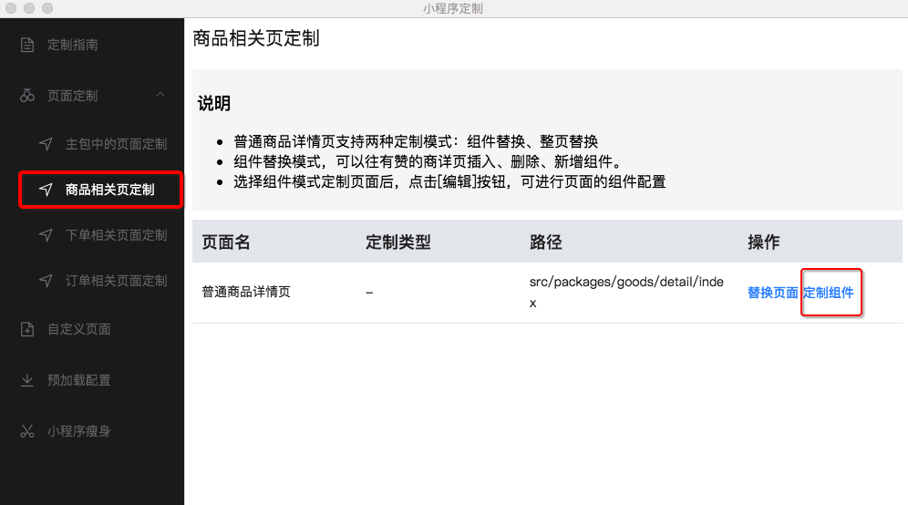
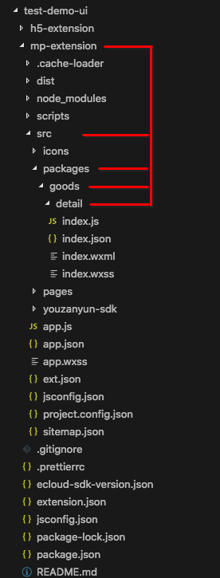
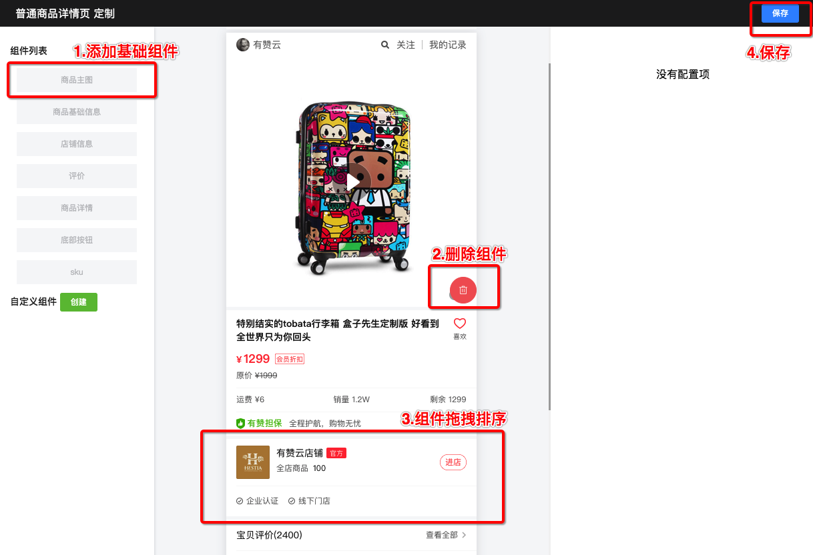
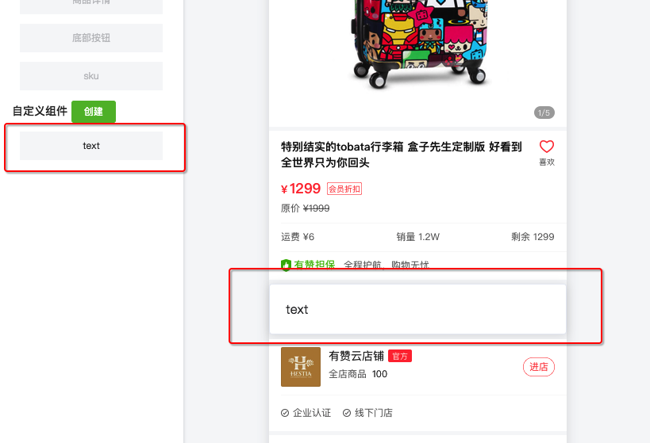
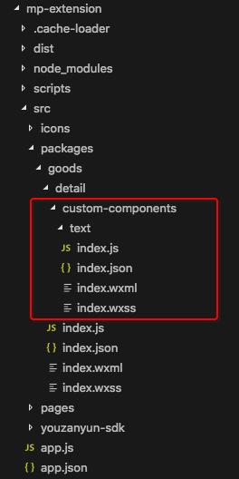

### 组件定制
（以商品详情页为例）
1. 点击‘定制组件’ 按钮，会在项目目录下，<路径> 所对应的位置生成开发框架结构
操作界面：  

项目目录：  

2. 点击‘编辑’按钮，进行组件配置及自定义组件开发

  - 基本操作：  
    1）点击组件列表中某一项，可以添加对应基本组件到页面中；  
    2）鼠标移动到组件上，出现删除按钮，可以删除当前组件；  
    3）拖动组件可以对组件位置进行排序  
  - 自定义组件开发  
    1）创建自定义组件（例：<名称>text）：  
    
    2）生成代码结构如下  
      
    3）保存配置 
3. 组件开发  
  - 可参考自动生成的demo，可使用sdk获取数据等方便定制开发
  - 打开微信小程序开发工具，导入项目下dist目录，开发调试
  - ⚠️注：本地开发调试时sdk数据属于mock数据，应用发布后数据会生效 
4. 提交代码，在diy.youzanyun.com应用管理页面，发布应用：
  - 开发环境发布： 打包小程序，生成体验码
  - 生产环境发布： 发布提交腾讯审核上线

